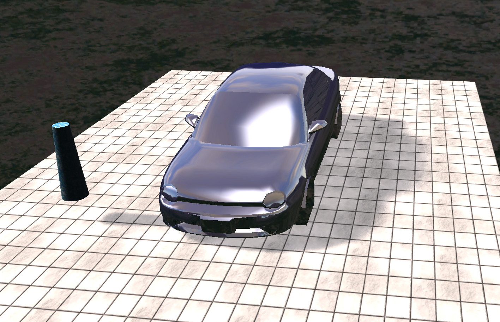

# Lumine

Lumine is an early-stage C++ based renderer for Windows built with DirectX 12. For more details, please refer to the sections below.

## Getting Started

Visual Studio 2019 is recommended. Start by cloning the repository with `git clone --recursive https://github.com/AmanThuL/lumine.git`.

If the repository was cloned __non-recursively__ previously, use `git submodule update --init` to clone the necessary submodules.

The project files are regenerable by using ``GenerateProjectFiles.bat``.

## Screenshots

### Shadow Techniques

#### Shadow mapping with PCF filtering (9 samples)

#### Percentage Closer Soft Shadows (PCSS)

## Structure

## References

### Graphics API Abstraction

The DirectX abstraction is based on a series of open source repositories and tutorials listed below.

- [Introduction to 3D Game Programming with DirectX 12](http://www.d3dcoder.net/d3d12.htm)
- [Falcor by NVIDIA](https://github.com/NVIDIAGameWorks/Falcor)
- [MiniEngine by Microsoft](https://github.com/microsoft/DirectX-Graphics-Samples/blob/master/MiniEngine)

### External Libraries

- [ImGui](https://github.com/ocornut/imgui)
